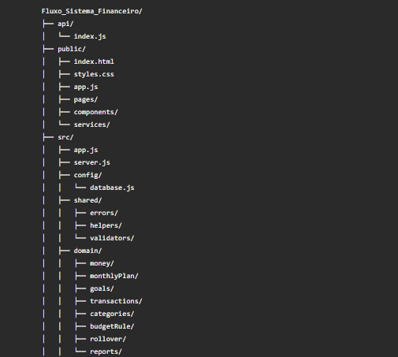
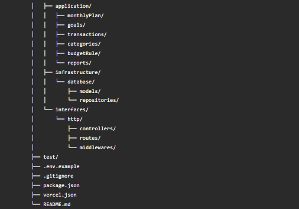

# 📊Fluxo - Sistema Financeiro

Sistema web de controle financeiro pessoal desenvolvido a partir da identidade visual do projeto Fluxo - Controle de Gastos.

O objetivo desse projeto é evoluir o controle mensal de gastos para um sistema financeiro completo, mantendo a interface limpa, responsiva e minimalista do Fluxo, mas acrescentando funcionalidades de receitas, despesas, categorias, metas, regra 50-30-20, relatórios, gráficos e persistência em MongoDB.

## 👁️ Visão geral
O ***Fluxo Sistema Financeiro*** permite que o usuário acompanhe sua vida financeira de firna simples e visual. O sistema combina:

- planejamento mensal;
- limite diário de gastos;
- metas financeiras;
- cadastros de receitas;
- cadastros de despesas;
- categorias personalizadas;
- dashboard financeiro;
- regra orçamentária 50-30-20
- rollover mensal de orçamento;
- relatórios financeiros;
- gráficos interativos;
- persistencia em MongoDB

## 💎 Funcionalidades principais
### Controle mensal
O sistema permite informar:

- receita mensal;
- gastos acumulados do mês;
- data inicial do planejamento.

A partir desses dados, o sistema calcula:

- restante total;
- limite diário;
- planejamento dos próximos 30 dias;
- saldo diário;
- orientação diária de gastos.

Exemplo de orientações:

- "Hoje você pode gastar até R$ X"
- "Você poderá gastar dinheiro amanhã"
- "Não é recomendado que você gaste dinheiro hoje"

### Metas financeiras
O sistema permite criar uma meta financeira informando:
- valor total da meta;
- quantidade de meses.

Com isso, o sistema calcula:
- valor mensal necessário;
- evolução acumulada;
- progresso percentual;
- último mês ajustado para fechar exatamente o valor da meta.

### Receitas
O sistema permitirá criar, listar, editar e excluir receitas.

Campos previstos:
- Valor;
- Data;
- Categoria;
- Descrição;
- Recorrente;
- Recebido;
- Grupo financeiro vinculado à regra orçamentária.

### Despesas
O sistema permitirá criar, listar, editar e excluir despesas.

Campos previstos:
- Valor;
- Data;
- Categoria;
- Descrição;
- Recorrente;
- Recebido;
- Grupo financeiro: Necessidades, Desejos ou Investimentos.

### Categorias
O sistema permitirá gerenciar categorias personalizadas para receitas e despesas.

Funcionalidades previstas:
- Criar categoria de receita;
- Criar categoria de despesa;
- Listar categorias;
- Excluir categorias;
- Associar categorias aos lançamentos financeiros.

Categorias padrão sugeridas para receitas:
- Salário;
- Freelance;
- Investimentos;
- Reembolso;
- Outros.

Categorias padrão sugeridas para despesas:
- Alimentação;
- Transporte;
- Moradia;
- Energia;
- Internet;
- Saúde;
- Educação;
- Lazer;
- Assinaturas;
- Desejos;
- Investimentos;
- Outros.

### Regra financeira 50-30-20
O sistema implementará a regra orçamentária 50-30-20:
- 50% para Necessidades/Custos;
- 30% para Desejos;
- 20% para Investimentos

O usuário poderá alterar os percentuais, desde que a soma seja sempre igual a 100%

Exemplos aceitos:
- 50-30-20
- 60-20-20
- 50-40-10

### Rollover mensal
O sistema permitirá acumular sobras de orçamento para os meses seguintes.

Regras principais:
- limite base = receita mensal x percentual do grupo;
- limite total = limite base + acumulado anterior;
- disponível = limite total - gasto atual;
- excedido = gasto atual - limite total
- sobra positiva acumula para o mês seguinte;
- excendente não gera acumulado separadamente.

### Dashboard financeiro
O dashboard exibirá:
- Saldo total
- Total de receitas;
- Total de despesas;
- Disponível no mês
- Maior categoria de gasto;
- Resumo da trgra 50-30-20;
- Últimos lançamentos.

### Relatórios financeiros
O sistema terá relatórios de:

- Receitas por categoria;
- Despesas por categoria;
- Receitas por mês;
- Despesas por mês;
- Fluxo de caixa acumulado;
- Distribuição da regra 50-30-20;
- Evolução mensal do saldo;
- Limites disponíveis e excedidos.

### Identidade visual
A identidade visual do projeto Fluxo será mantida.

Elementos preservados:

- nome visual Fluxo;
- marca com a letra F;
- layout limpo e minimalista;
- fundo claro;
- cards arredondados;
- botões arredondados;
- tabelas elegantes;
- responsividade;
- cores em tons de verde, lime, amber e vermelho;
- feedback visual por status.

## 🧑🏻‍💻 Stack utilizada
***Banco de dados***
- MongoDB Atlas

***Backend***
- Node.js
- Express
- Mongoose
- Dotenv

***Frontend***
- HTML
- CSS
- JavaScript

***Testes***
- Node Test Runner

***Deploy***
- Vercel

### Arquitetura planejada
O projeto seguirá uma organização em camdas para manter o código limpo e fácil de evoluir.

Estrutura planejada:





### Regras de negócio
***Controle mensal***
- Restante total = Receita mensal - gastos do mês
- Limite diário = receita mensal / 30
- Restante planejado do dia = receita mensal - (limite diário x número do dia)
- Saldo diário = restante total - restante planejado do dia

Os valores devem ser calculados internamente em centavos para evitar erros de ponto flutuante.

***Regra 50-30-20***
- Necessidades + Desejos + Investimentos = 100%

A regra padrão será:
- Necessidades: 50%
- Desejos: 30%
- Investimentos: 20%

***Rollover mensal***
- Limite base = receita mensal * percentual do grupo
- Limite total = limite base + acumulado anterior
- Disponível = Limite total - gasto atual
- Excedido = gasto atual - limite total

Apenas valores positivos acumulam para o próximo mês.

### Modelagem inicial do MongoDB

#### MounthlyPlan

***BudgetPlan***
```js
{
    monthlyIncomeCents: Number,
    monthlyExpensesCents: Number,
    startDate: String,
    createdAt: Date,
    updateAt: Date
}
```

***SavingGoals***
```js
{
    title: String,
    targetAmountCents: Number,
    months: Number,
    startDate: String,
    active: Boolean,
    createdAt: Date,
    updateAt: Date
}
```

***Transaction***
```js
{
    type: "income" | "expense",
    amountCents: Number,
    date: String,
    categoryId: objectId,
    categoryName: String,
    budgetGroup: "nedds" | "wants" | "investments",
    description: String,
    isRecurring: Boolean,
    isPaid: Boolean,
    createdAt: Date,
    updateAt: Date
}
```

***Category***
```js
{
    name: String,
    type: "income" | "expense",
    isDefault: Boolean,
    createdAt: Date,
    updateAt: Date
}
```

***BudgetRule***
```js
{
    needsPercent: Number,
    wantsPercent: Number,
    investmentsPercent: Number,
    active: Boolean,
    createdAt: Date,
    updateAt: Date
}
```

### Endpoints da API

***Saúde da API***
```js
GET /api/health
```

***Controle mensal***
```js
GET /api/mounthly-plan
PUT /api/mounthly-plan
```

***Metas financeiras***
```js
GET /api/savings-goal
PUT /api/savings-goal
```

***Receitas e despesas***
```js
GET /api/transactions
POST /api/transactions
GET /api/transactions/:id
PUT /api/transactions/:id
DELETE /api/transactions/:id
```

Filtros planejados:
```js
GET /api/transactions?type=income
GET /api/transactions?type=expense
GET /api/transactions?month=6&year=2026
GET /api/transactions?categoryId=...
GET /api/transactions?isPaid=true
GET /api/transactions?isRecurring=true
```

***Categorias***
```js
GET /api/categories
POST /api/categories
DELETE /api/categories/:id
```
Filtros planejados:
```js
GET /api/categories?type=income
GET /api/categories?type=expense
```

***Relatórios***
```js
GET /api/reports/summary
GET /api/reports/by-category
GET /api/reports/cash-flow
GET /api/reports/budget-rule
GET /api/reports/monthly-evolution
```

### 💻 Como executar localmente

#### 1. Clonar o repositório
```bash
git clone https://github.com/kamikazedojapan/Fluxo_Sistema_Financeiro.git
cd Fluxo_Sistema_Financeiro
```

#### 2. Instalar dependencias
```bash
npm install
```

#### 3. Configurar variáveis de ambiente
Copie o arquivo *.env.example* para *.env*:
```bash
copy .env.example .env
```
No linux/macOS:
```shell
cp .env.example .env
```
Depois configure:
```js
MONGODB_URI=mongodb+srv://<usuario>:<senha>@<cluster><database>retryWrites=true&w=majority
PORT=3000
NODE_ENV=development
```

#### 4. Rodar testes
```bash
npm test
```

#### 5. Iniciar o servidor
```cmd
npm start
```
Ou em modo desenvolvimento:
```bash
npm run dev
```

#### 6. Acessar no navegador
http://localhost:3000

## 🧾 Como testar a API
Após inciar o servidor, acesse:

http://localhost:3000/api/health

Resposta esperada:
```js
{
    "ok": true,
    "mongodbConfigured": true
}
```
Se *mongodbConfigured* estiver como *false*, verifique se a variável *MONGODB_URI* foi configurada corretamente.

### Como fazer deploy na Vercel

#### 1. Instalar a Vercel CLI
```
npm i -g vercel
```

#### 2. Configurar variáveis de ambiente na Vercel
No painel do projeto, configure:
```
MONGODB_URI
NODE_ENV=production
```

#### 3. Fazer deploy
```
vercel --prod
```

#### 4. Testar produção
Após o deploy, acesse:

https://SEU-DOMINIO/api/health

### Segurança
Nunca coloque dados sensíveis no repositório.

Não versionar:
- .env;
- node_modules;
- .vercel;
- credenciais reais do MongoDB;
- senhas;
- tokens;
- chaves privadas.

O arquivo .env.example deve conter apenas exemplos genéricos.

### Scripts disponíveis
Inicia o servidor:
```cmd
npm start
```

Inicia o servidor em modo desenvolvimento:
```bash
npm run dev
```

Executa os testes automatizados:
```bash
npm test
```

### Status do projeto
O projeto está em fase de reestruturação para evoluir de um controle mensal de gastos para um sistema financeiro completo.

## 🧔🏻 Autor
#### </> Desenvolvido por Márcio Reis
#### 📍GitHub: kamikazedojapan